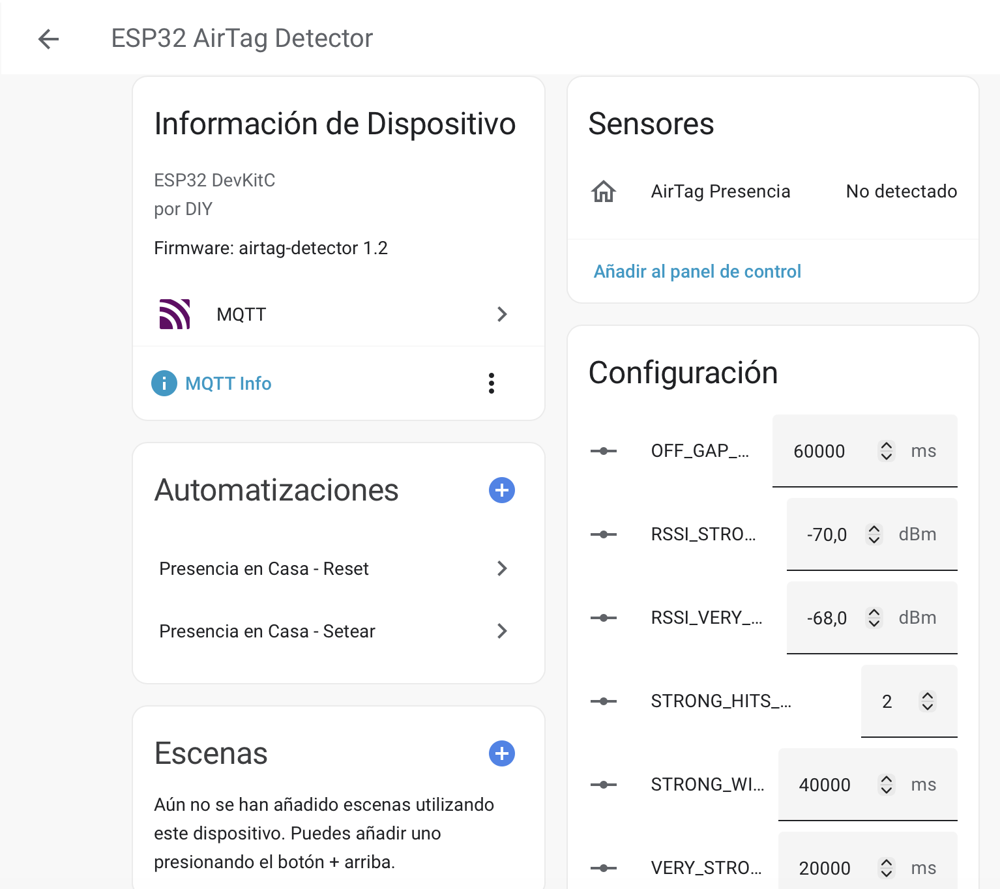

# ESP32 BLE Presence Detector for Home Assistant

Este proyecto consiste en un detector de presencia basado en ESP32 utilizando la biblioteca NimBLE para escanear dispositivos BLE como las AirTags de Apple. Permite publicar estados de presencia en MQTT/Home Assistant y ajustar parámetros por MQTT o almacenar datos en la NVS del ESP32.

## Características principales

* **Detección BLE**: Escanea anuncios Bluetooth Low Energy de dispositivos cercanos, filtrando por fabricante (Apple) o direcciones MAC configuradas.
* **Publicación MQTT**: Envía mensajes de presencia a un servidor MQTT para integrarse fácilmente con Home Assistant.
* **Configuración dinámica**: Permite actualizar valores de configuración (por ejemplo, umbral de señal o lista de dispositivos) mediante comandos MQTT o a través de la memoria NVS del microcontrolador.
* **Bajo consumo**: Utiliza el stack NimBLE de Espressif para reducir el uso de memoria y energía.

## Requisitos

* Una placa **ESP32** compatible (por ejemplo, DevKit v4).
* IDE Arduino o PlatformIO.
* Librerías recomendadas:
  - [NimBLE-Arduino](https://github.com/h2zero/NimBLE-Arduino) para el escaneo BLE.
  - [PubSubClient](https://github.com/knolleary/pubsubclient) para la comunicación MQTT.
  - [Preferences](https://github.com/espressif/arduino-esp32/tree/master/libraries/Preferences) para almacenamiento NVS.

## Estructura del proyecto

```
esp32-ble-presence/
├── src/
│   └── main.cpp         # Código principal del firmware
  ├── cover.png        # Imagen de portada para la documentación
├── demo-mqtt.png    # Captura de interfaz en Home Assistant
├── ├── LICENSE          # Licencia MIT
.gitignore
└── README.md
```

## Uso básico

1. Clona este repositorio y abre la carpeta `esp32-ble-presence` en tu IDE preferido.
2. Configura las credenciales Wi‑Fi y los parámetros MQTT en `src/main.cpp`.
3. Carga el código en tu ESP32.
4. Registra las direcciones MAC o UUIDs de los dispositivos que deseas detectar.
5. Conecta Home Assistant a tu broker MQTT para visualizar los cambios de presencia.
## Manual rápido de uso

1. **Compilar y cargar**: Clona este repositorio y abre el directorio en tu IDE (Arduino IDE o PlatformIO). Compila y sube el firmware al ESP32.
2. **Configurar por primera vez**: Al arrancar por primera vez, el ESP32 crea un punto de acceso Wi‑Fi (`ESP32‑Setup‑XXXXXX`, contraseña `ConfiguraESP`). Conéctate a esa red y visita `http://192.168.1.1` para introducir tu SSID y clave de Wi‑Fi, así como los datos de tu servidor MQTT (host, puerto, usuario y contraseña). Guarda y reinicia.
3. **Integración en Home Assistant**: Al reiniciar, el dispositivo se conectará automáticamente a tu red y publicará estados a través de MQTT. Home Assistant detectará automáticamente la entidad de presencia y varios números configurables. Desde el panel de "Dispositivos y servicios" podrás ajustar umbrales RSSI, ventana de detección y otros parámetros.
4. **Reset y ajustes**: Para restablecer la configuración (Wi‑Fi/MQTT/parámetros) mantén pulsado el botón BOOT (GPIO0) durante 10 segundos. También puedes ajustar parámetros en caliente enviando comandos MQTT a los topics `home/esp32-airtag-1/params/...`.

A continuación se muestra un ejemplo de cómo se integra y configura en Home Assistant:


## Licencia

Este proyecto se distribuye bajo la licencia MIT (consulta el archivo `LICENSE`).
